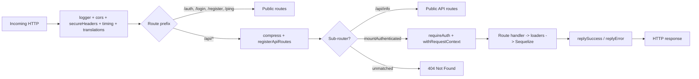

# Server Onboarding

A short guide so a new developer can start shipping in `packages/server` the
same day. Everything here is linked back to real files; prefer the code when
something looks stale.

## 1. Stack in one paragraph

- HTTP framework: [Hono](https://hono.dev/) + `@hono/node-server` (Node 20).
- WebSockets: `@hono/node-ws`.
- ORM / DB: Sequelize on PostgreSQL, models in `@stacks/db`.
- Auth: JWT (HS256) via Authorization header or signed cookie.
- i18n: `@stacks/translations` + JSON files under `locales/`.
- AI: Vercel AI SDK (`ai`, `@ai-sdk/openai`) streamed over WS.
- Build: `esbuild` bundle with a custom integrity signing plugin.
- Tests: `vitest` (unit + integration).

## 2. Bootstrap order

`src/index.ts` is the entry point. The order matters; do not re-shuffle
without reading this section.

```
1. initializeEmbeddedIntegrityCheck()   // hash-verify the production bundle
2. assertProductionSecretsAtStartup()    // fail fast if secrets are missing
3. i18n preload                          // load locale JSON synchronously
4. Build Hono app + register middleware, routes, WS
5. bootstrap():
     await connectDb()                   // open Sequelize pool
     await initLicense()                 // load license cache (seed needs it)
     await seedDatabase()                // seed tenant/role defaults
     serve({ fetch, port })              // only now accept requests
     injectWebSocket(server)
```

Anything before `bootstrap()` must be synchronous or wrapped so it cannot
delay the Hono app object being exported (tests import `app` directly).

Skip conditions:
- `NODE_ENV=test` skips integrity check, secret assertions, and the whole
  `bootstrap()` DB/license sequence. Tests use `test/globalSetup.ts` instead.
- `NODE_ENV=development` skips integrity unless `FORCE_INTEGRITY_CHECK=1`.

## 3. Request lifecycle



Key points:
- `requireAuth` decodes the JWT, loads the `User` + `Role` from the DB, and
  sets `user`, `userRole`, `userId`, `userTenant`, `instanceId` on `c`.
- `withRequestContext` copies those into an `AsyncLocalStorage`. From there
  loaders can call `getCurrentUser()` / `getCurrentRole()` /
  `getInstanceId()` without the caller threading the user through.
- Authenticated `/api/*` sub-routers are mounted via the `mountAuthenticated`
  helper in `src/api.ts`, which wraps each sub-router with `requireAuth` +
  `withRequestContext`. **Auth is not a broad `app.use("/api/*", ...)` prefix
  middleware** — that pattern would shadow real 404s with a misleading
  "Authentication token missing" 401 on unmounted paths. Unknown `/api/*`
  requests now fall through to Hono's default 404.
- Errors thrown from handlers bubble to `app.onError(errorHandler)`, which
  serialises them via `replyError`.

## 4. Platform subsystems (read before touching)

These are small, intentional pieces. Don't rewrite them without understanding
why they exist; the doc-comments inside each file repeat the contract.

- **`embedded-integrity.ts`** — SHA-256 + RSA signature of the built bundle.
  The signing plugin (`esbuild-integrity-plugin.js`) replaces placeholders at
  build time; this file verifies them at boot. Skipped in dev/test.
- **`utils/cache.ts`** — Single-process TTL + LRU cache. Keys are
  tenant-scoped via `requestContext.getCurrentUser()`. Swap for Redis if you
  outgrow a single node.
- **`services/requestContext.ts`** — `AsyncLocalStorage` wrapper. Provides
  `user`, `role`, `instanceId`, `requestId` to loaders.
- **`events.ts`** — Enhanced `EventEmitter` plus WS connection/message-queue
  bookkeeping. `emitUpdate()` is the single outbound mutation broadcast path.
- **`middleware/admin.ts`** — Reuses the `userRole` already loaded by
  `requireAuth`; do not re-query `RoleEntity` here.
- **`middleware/roleAccess.ts`** — Section/action gate based on `userRole`;
  admins skip the check. Errors propagate to the global handler.

## 5. How to add a route

1. Pick (or create) a domain file under `src/routes/`, e.g. `widgets.ts`.
2. Build the sub-app. Don't apply `requireAuth` inside the router — auth is
   attached at mount time by `mountAuthenticated` (see step 3). Public routes
   omit `mountAuthenticated` and skip auth entirely.

   ```ts
   import { Hono } from "hono";
   import { validator } from "../middleware/validator";
   import { WidgetsLoader } from "../loaders";
   import { asyncHandler } from "../utils/errorHandler";
   import { WidgetCreateSchema } from "./schema/widget";

   const widgets = new Hono();

   widgets.get("/", asyncHandler(async c => {
       const rows = await WidgetsLoader.getAll();
       return c.replySuccess(rows);
   }));

   widgets.post(
       "/",
       validator("json", WidgetCreateSchema),
       asyncHandler(async c => {
           const body = c.req.valid("json");
           const created = await WidgetsLoader.create(body);
           return c.replySuccess(created, "Created");
       })
   );

   export default widgets;
   ```

3. Mount it in `src/api.ts`. Use the right helper for the auth posture:

   ```ts
   // Authenticated: wraps the router in requireAuth + withRequestContext and
   // mounts at /api/widgets. This is the default for resource routes.
   mountAuthenticated("widgets", widgets);

   // Public (no auth): direct mount. Reserve this for routes that must be
   // reachable unauthenticated — e.g. /api/info (AGPL source disclosure).
   app.route("/api/widgets", widgets);
   ```

   Picking `app.route("/api/...", router)` for a route that *should* be
   authenticated will silently mount it unauthenticated — there is no longer
   a global `app.use("/api/*", requireAuth)` to catch the omission. When in
   doubt, default to `mountAuthenticated`.

4. If the route needs a loader, add `src/loaders/widgets.ts`, export it from
   `src/loaders/index.ts`, and use `sanitizeWhere` / `sanitizeWherePermissions`
   from `src/loaders/utils.ts` so tenant/permission scoping is consistent.
5. Add a Zod schema in `src/routes/schema/` and reuse it in both the request
   validator and any OpenAPI/docs layer.
6. Tests live in `src/__tests__/` or `src/loaders/__tests__/`. Prefer loader
   tests with `requestContext.run(...)` over HTTP-level tests when you just
   need to validate SQL scoping.

## 6. Useful commands

Run from the repo root:

```
yarn workspace @stacks/server dev          # tsc + nodemon
yarn workspace @stacks/server build        # esbuild + post-build
yarn workspace @stacks/server start        # run dist/server.js
yarn workspace @stacks/server test:unit    # fast unit tests
yarn workspace @stacks/server test         # full vitest suite
yarn workspace @stacks/server typecheck    # tsc --noEmit
```

## 7. FAQ

- **Where does the current user come from inside a loader?**
  `requestContext.getCurrentUser()` (or `getCurrentUser()` from
  `src/loaders/context.ts`). `requireAuth` + `withRequestContext` populated it.
- **Why does `admin.ts` not hit the database?** Because `requireAuth` already
  loaded the role into `c.get("userRole")`. Re-querying it on every admin
  route was a duplicated round-trip and has been removed.
- **Why do some routes still call `c.get("user") as User`?** Public routes
  (before `requireAuth`) can have `undefined` users; the cast is a deliberate
  hint that the caller handles the missing case.
- **Why is the cache in-process?** One node, low volume, tenant-scoped keys.
  Move to Redis when those assumptions break.
